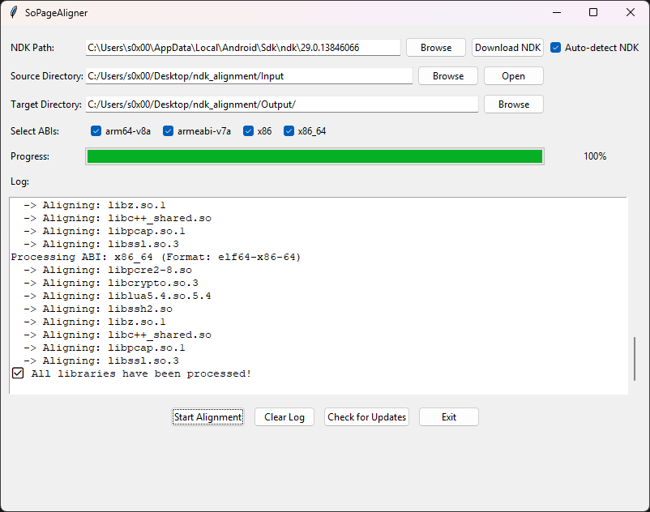

# SoPageAligner v1.0.1

Automatically fixes the **Android Studio 4KB / 16 KB page size issue** for native libraries.



## Background

When building native libraries in Android Studio, `.so` files are often generated with a **4 KB page size**. 

**SoPageAligner** automatically aligns `.so` files to the correct 16KB page size for each ABI, fixing this problem.

Changelog:

- v1.0.1: Updated build with improved PyInstaller settings (no code changes)

## Features

- Auto-detect Android NDK installation
- Align `.so` files for multiple ABIs: `arm64-v8a`, `armeabi-v7a`, `x86`, `x86_64`
- Fixes 16 KB page size issues in native libraries
- GUI with progress bar and log window
- Open source and output directories directly
- Download NDK link for convenience

## Requirements

- Python 3.8+
- `tkinter` (standard in Python)
- Android NDK installed

## Installation

1. Clone the repository:
```bash
git clone https://github.com/fzer0x/SoPageAligner.git
cd SoPageAligner
